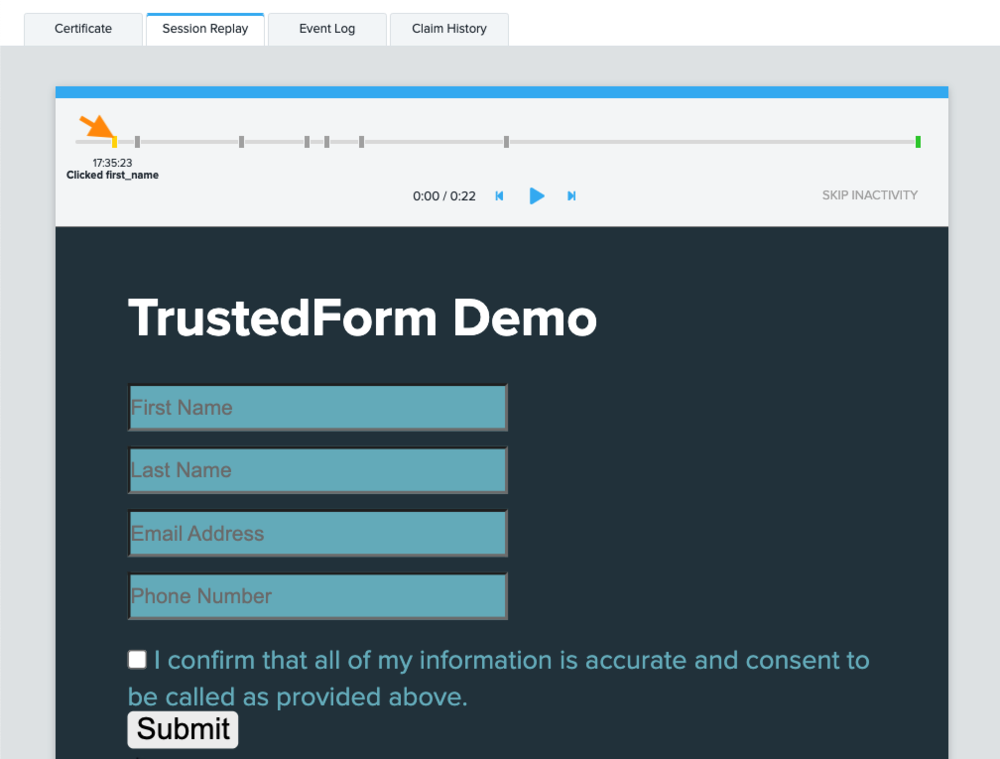
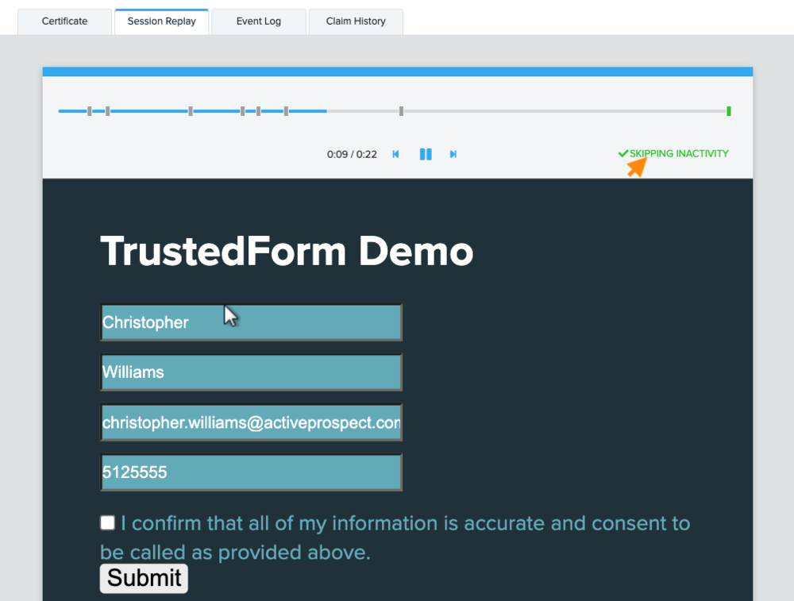
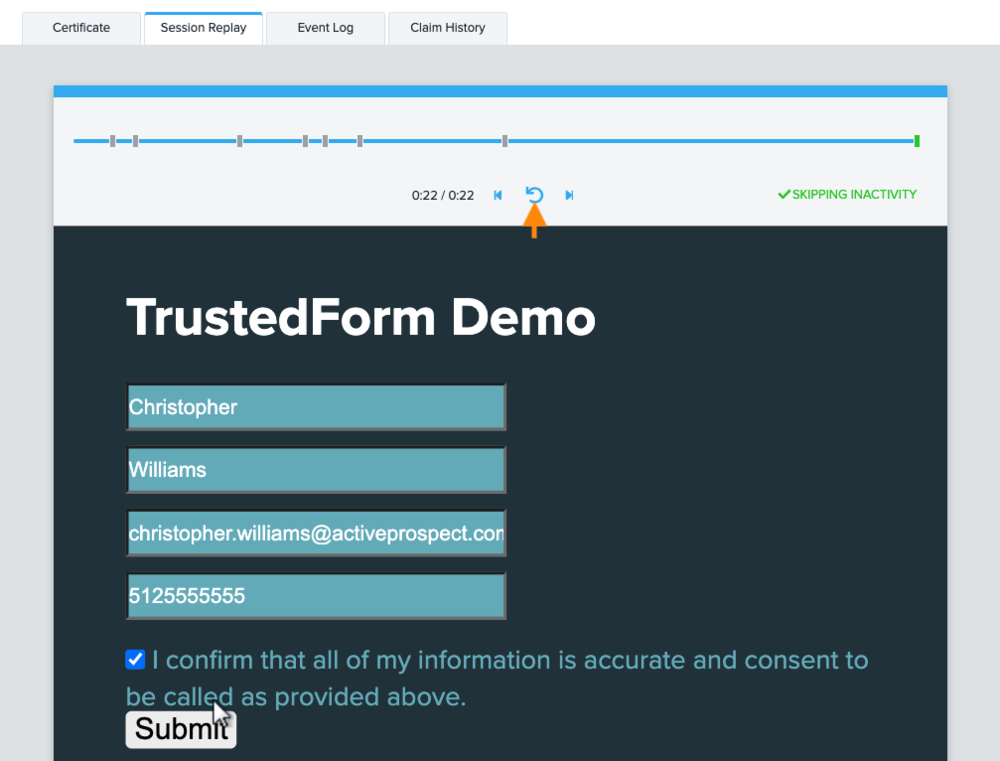
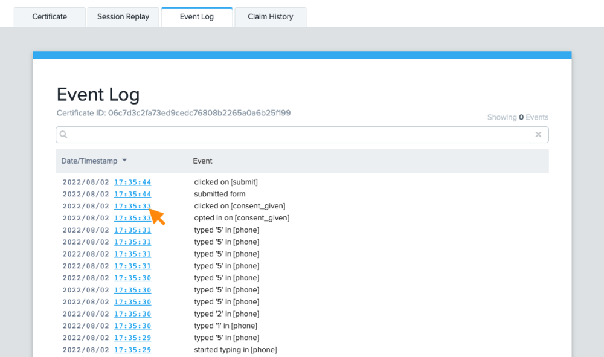
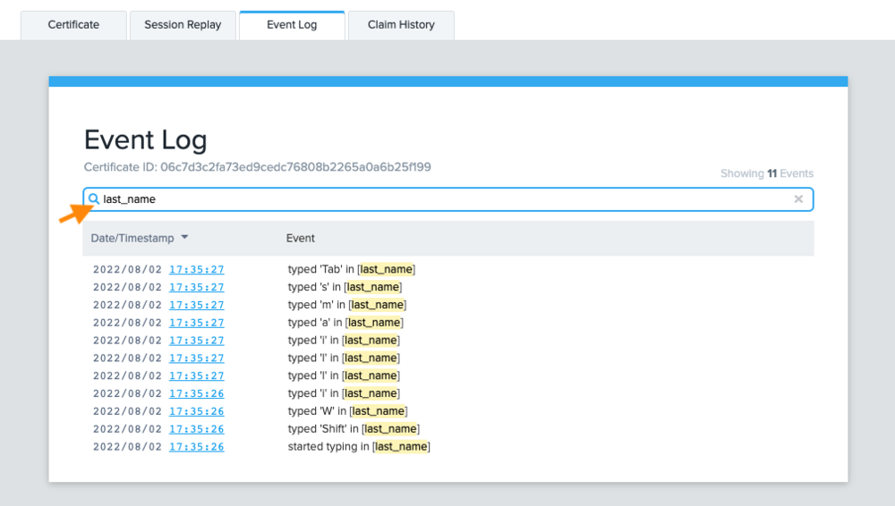

[_Christopher Williams_](https://community.activeprospect.com/memberships/7846678-christopher-williams)

Updated March 6, 2025. Published August 10, 2022.

Details

# TrustedForm Session Replay Enhancements

Now it's easier to find the exact moments that matter!

The session replay shown in TrustedForm certificates is the best tool you have to understand the experience a user had while interacting with a web page hosting the TrustedForm script. A recreation of that experience is built using a copy of the web page and a detailed log of all the events that occurred during the user's visit. That recreation is shown in the Session Replay tab of TrustedForm certificates and now includes enhancements to highlight the most pertinent events and allow you to quickly jump to any of them. Use these tip to efficiently find points of interests and see the events you care about.

1\. Hover over events in the timeline to see what happened

2\. Click on events or anywhere on the timeline to jump ahead to that moment

3\. Use the previous/next event buttons to navigate through interactions

4\. Enable ""SKIP INACTIVITY"" to breeze past period where nothing happened

5\. After you've watched the replay, start from the beginning and watch again

6\. Jump to a specific moment in the session replay from the event log

7\. Search the event log for exactly what you want to see

#### Frequently Asked Questions

- **Which TrustedForm product do I need to use this feature?**

These session replay enhancements are available to all accounts that have TrustedForm's ""Claim"", ""Consent"" or ""Retain"" product.
- **Will these enhancements be added to my earlier certificates?**

No, these enhancements are only available for certificates created after it released. Previously existing certificates have already been archived using previous versions of the session replay. In order to maintain the integrity of TrustedForm certificates we do not push updates to existing certificates.
- **Why is one of the events green?**

The final form submission event is colored green to highlight when the consumer submitted the form as this is often the most important event when determining if consent was provided.

Type something
