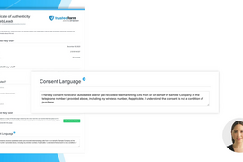

[_Christopher Williams_](https://community.activeprospect.com/memberships/7846678-christopher-williams)

Updated May 8, 2025. Published September 13, 2024.

Details

# TrustedForm Verify Approved Language Check

Obtaining meaningful consent from a consumer can be extremely complicated as there are many interpretations of the laws that govern how advertisers perform marketing outreach. These generally result in every business establishing their own set of requirements for the language consumers must consent to in order to become a valid lead. Due to this the best way to ensure that your requirements are met is to review the aforementioned language and only contact leads if you approve of it. TrustedForm Verify's Approved Language Check makes it simple to do this in a scalable manner for all your leads and all the variations of consent language they are shown.

# How It Works

First, ask your lead vendors to implement [TrustedForm Certify](https://activeprospect.com/trustedform/certify) and send a TrustedForm Certificate URL along with the leads you purchase from them. This will give you access to the consent languages shown to each lead. Next use the [Certificate API](https://developers.activeprospect.com/docs/trustedform/api/v4.0/tag/Certificate-URL/) and make a [Verify request](https://developers.activeprospect.com/docs/trustedform/api/v4.0/tag/Verify/) which will extract the consent languages and make them accessible in the response. It will also add new variations to your [consent language manager](https://community.activeprospect.com/posts/5474006-trustedform-consent-language-manager) as long as there you have less than 1000 unreviewed consent languages. Make sure to review all the consent languages found in the unreviewed section and determine whether future leads using them should be approved or rejected. Once classified, the Approved Language Check will use this to determine if future leads were shown an approved consent language or not. Keep in mind that Verify searches for your approved/rejected consent language within the overall consent language found. This means if you approve the short phrase ""I consent"" then any consent language found that contains that will successfully pass Verify's consent language check (e.g. ""I consent to receive marketing messages""). Passing this check requires an exact match, ignoring case differences, unless you add flexibility using wildcards. You can rely on this to create filters or rules to prevent your business from taking unnecessary risks.

A consumer filled out a form with a new consent language and you are sent the lead.You see that new consent language in your consent language manager and move it to approved.You receive another lead with that is shown the same consent language and make an API request to confirm that the language is now approved.
Collapse

00:00

01:40

#### Verify.mp4

# Frequently Asked Questions

1. **Can I approve new consent languages so that they don't get rejected?**

No. New consent languages are just as risky as rejected consent languages which is why they both return ""false"" when the approved language check is used. We recommend having your vendors send test leads anytime they make changes to their consent language so that your have an opportunity to approve it and avoid unnecessary rejections.

New consent languages will come in under the unreviewed section in your [consent language manager](https://community.activeprospect.com/posts/5474006-trustedform-consent-language-manager).
2. **What happens if the lead isn't shown a consent language?**

In this case the approved language check will return ""false"" since an approved consent language was not present. In addition the reason property will contain ""Consent language not detected in the certificate."" to give you additional details if you are investigating why leads fail this check.
3. **Is this the same thing as the page scan feature that is part of TrustedForm Insights?**

No. Page scan is intended to be used if you are looking for the presence of certain words or phrases to infer how the lead was incentivized to complete the form. If you are trying to determine that express written consent was obtained from your leads use Verify. It is specifically designed to search for consent and reduces the workload involved with managing multiple variations of it. Verify will also continue to add features which help manage compliance overall.
4. **Can I manually add consent languages so they are approved before they are shown to my leads?**

Yes. You can [manually add approved language to your consent language manager](https://community.activeprospect.com/posts/5448162-manually-add-approved-language-to-trustedform-verify-consent-language-manager).
5. **Can I add a wildcard to account for parts of a consent language that may change for each consumer?**

Yes. When adding or editing a consent language you can use the ""Insert Wildcard"" button to replace a dynamic portion of text with our wildcard character. This make consent languages that are the same except for the text represented by wildcards match.
6. **Are consent languages in spanish or other languages automatically translated to english?**

No. All consent languages are preserved as they were displayed. This means that if a consent languages that translate to one of your approved languages will fail is they are written in a different language. To prevent this you'll have to approve consent language variations in all the languages they will be displayed in.
Type something
