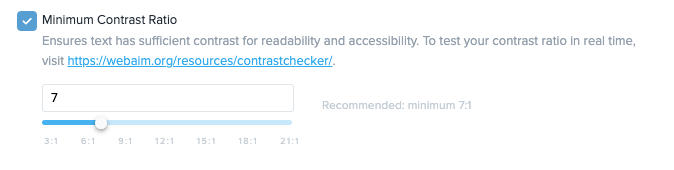

[_Christopher Williams_](https://community.activeprospect.com/memberships/7846678-christopher-williams)

Updated May 20, 2025. Published February 18, 2025.

Details

# TrustedForm Verify Contrast Ratio Check

Ensuring that the contrast ratio of consent language compared to used to generate leads compared to its background meets the clear and conspicuous requirement of the Telephone Consumer Protection Act (TCPA) is crucial for compliance and risk mitigation. If the contrast ratio is too small, it could be deemed insufficiently clear, leading to potential regulatory violations, legal challenges, and financial penalties. TrustedForm Verify's Contrast Ratio Check is a new feature that enables you to programmatically verify that each lead was shown a consent language of at least a certain contrast. This can be used to meet [R.E.A.C.H. standards](https://www.reachmbc.com/reach-standards) which require consent language is ""in a color highly contrasting with the background"" and [Web Content Accessibility Guidelines (WCAG) level AAA](https://www.w3.org/WAI/WCAG21/Understanding/contrast-enhanced.html) which requires ""The visual presentation of text and images of text has a [contrast ratio](https://www.w3.org/WAI/WCAG21/Understanding/contrast-enhanced.html#dfn-contrast-ratio) of at least 7:1"".

# How It Works

First, ask your lead vendors to implement [TrustedForm Certify](https://activeprospect.com/trustedform/certify?_gl=1*1svxali*_gcl_au*NzQzNzM3ODgwLjE3Mzg1OTY4NTUuMTE5Mzg3NzEzLjE3Mzg4ODY5MzQuMTczODg4Njk1Mg..*_ga*OTA3MjA4OTIuMTY5OTQxNDgwMg..*_ga_QHXBV6N7D1*MTczOTkxNjE0OC42MC4xLjE3Mzk5MjA4NjEuNjAuMC4w) and send a TrustedForm Certificate URL along with the leads you purchase from them. This is necessary to give you the required transparency into each lead. Next enable the minimum contrast ratio requirement on your [verification criteria page](https://app.trustedform.com/verification_criteria?__hstc=41051389.bf10695ae71d2133b698b37e11aa6c3d.1730924472413.1745937534129.1745940426354.400&__hssc=41051389.2.1745940426354&__hsfp=1174180583) and click Save.

Next use the [Certificate API](https://developers.activeprospect.com/docs/trustedform/api/v4.0/tag/Certificate-URL/) and make a [Verify request](https://developers.activeprospect.com/docs/trustedform/api/v4.0/tag/Verify/) which will run all of the checks you have enabled (note you can also modify your requirements per query using request parameters). Send the results to the system you use to make purchasing decisions or your CRM depending on where you want to use this data. If you don't have a system that is able to integrate with this feature consider purchasing [LeadConduit](https://activeprospect.com/leadconduit).

The results will include a ""success"" property that should be used to determine how to proceed.

- If ""success"" equals false then that means one of your checks has failed and you should not contact this lead or at least avoid using regulated technology. The ""reason"" property will explain which checks failed and why. Use this along with a potential manual review of the certificate to inform your vendor(s) of the issue(s) that need to be resolved for future leads.
- If ""success"" equals true then that means all of your checks have passed and this lead should continue to progress through your normal processes.

_Note: This check cannot be performed on__certificates generated from Meta Lead Ads or native mobile applications._

# Frequently Asked Questions

1. **What should I set as my minimum contrast ratio?**

There isn't a one size fits all answer to this question but we recommend you consult your compliance/legal teams and industry best practices to determine a suitable minimum for you.
2. **Does using the Contrast Ratio Check satisfy all of the FCC’s  clear and conspicuous requirements?**

No, complying with all of the requirements requires a broad strategy that should be discussed with your compliance/legal teams. However, using the Contrast Ratio Check is an essential defense against common allegations that consent language is unclear or inconspicuous.

Type something
