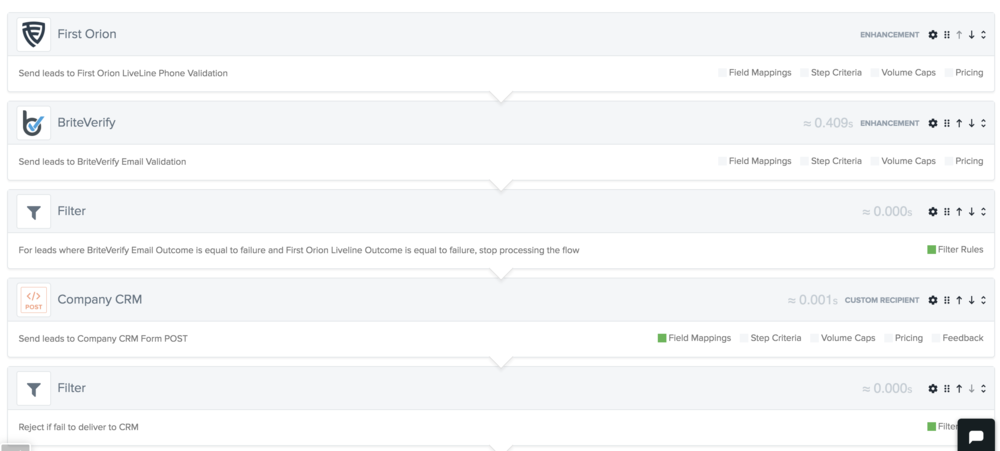
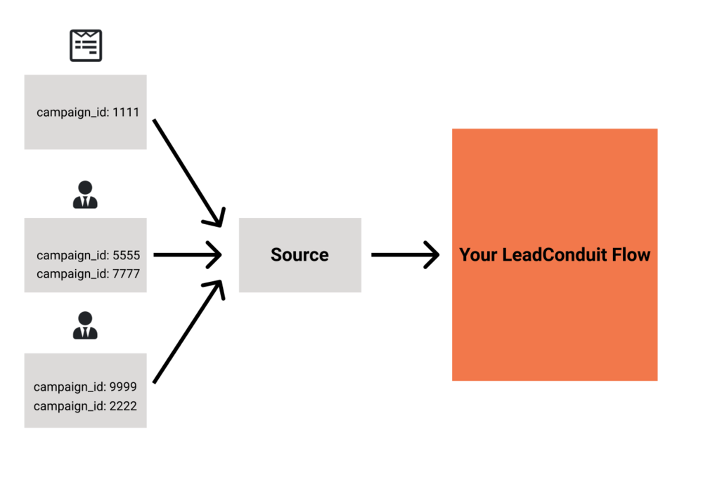
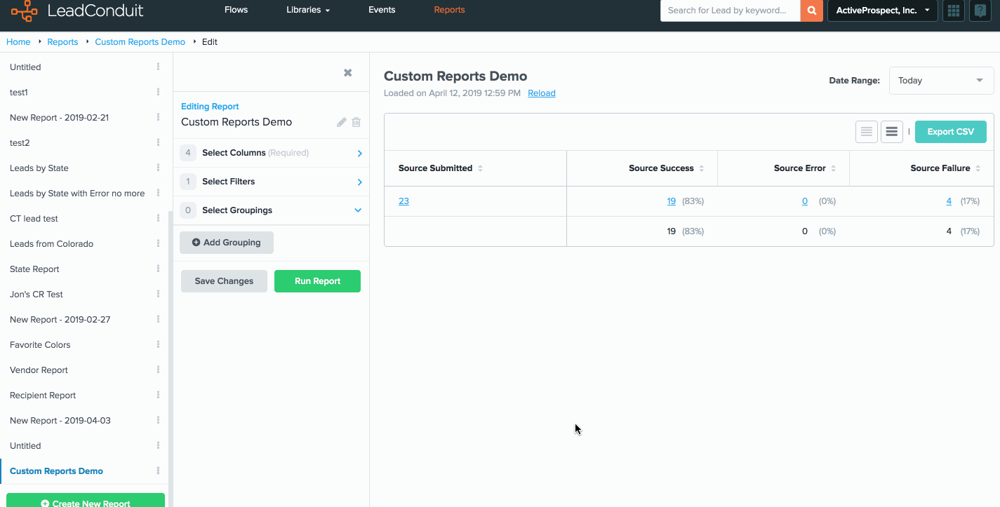
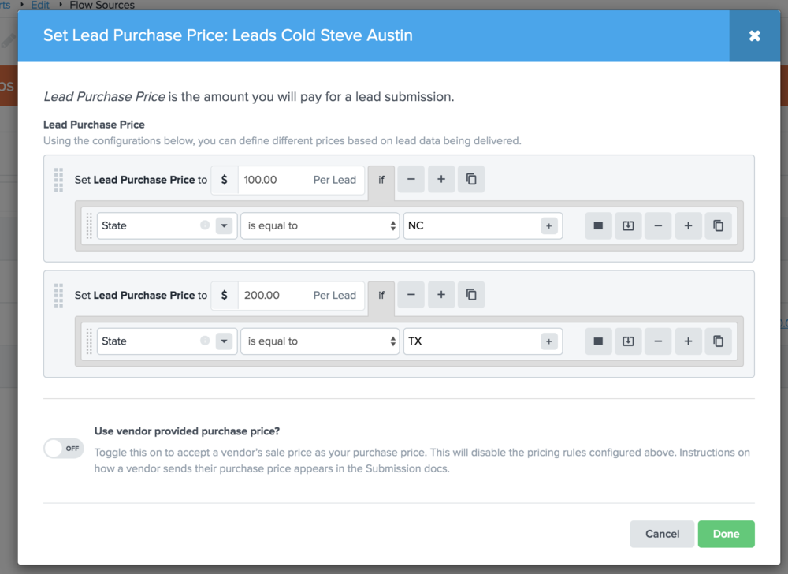
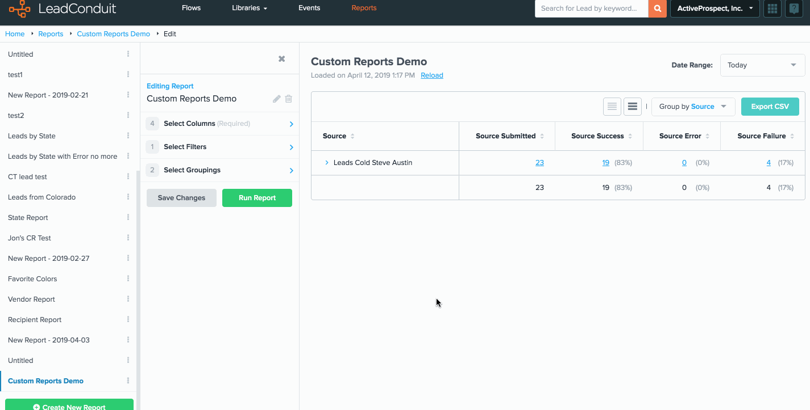
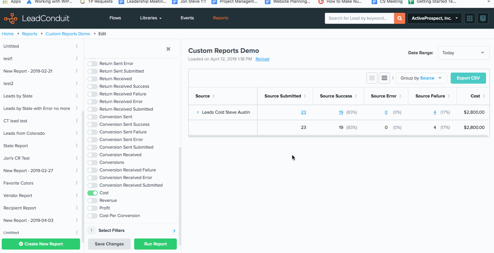
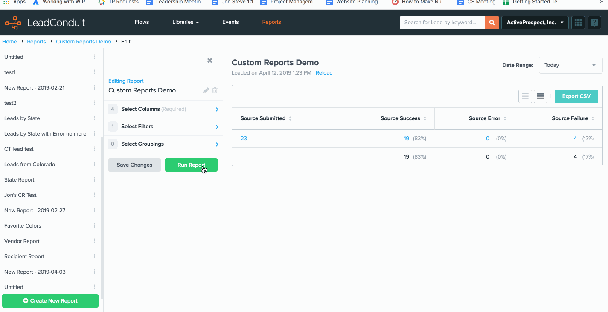
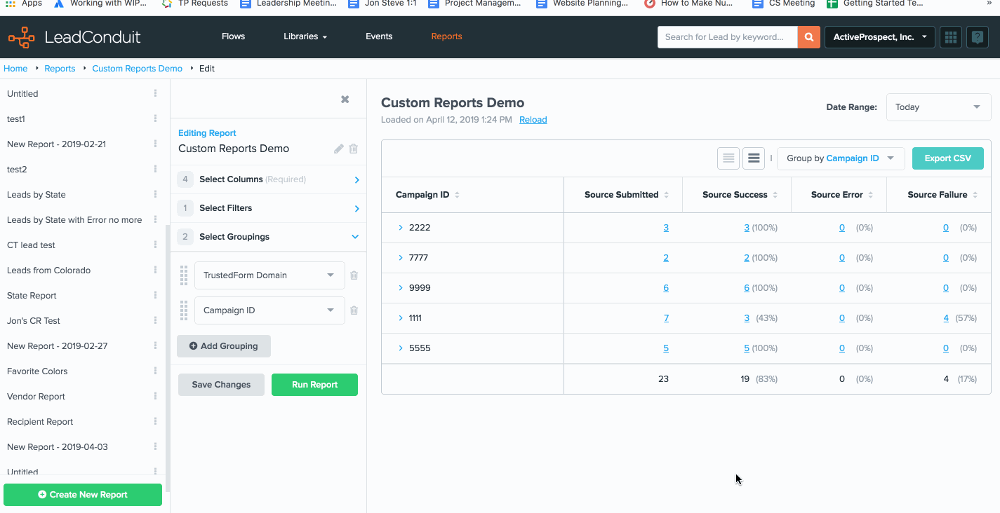

[_Scott McKee_](https://community.activeprospect.com/memberships/7557680-scott-mckee)

Updated September 15, 2022. Published February 17, 2021.

Details

# Using Custom Reports

# Custom Reports: A Month in the Life of a Lead Buyer

Let's start with a simple scenario. You're a lead buyer and LeadConduit user. You have a single flow that receives leads from one source - a lead vendor. This lead vendor collects leads from several of their own web forms, as well as purchasing leads from other lead vendors. All this lead data eventually gets sent to your flow where you use enhancements to check for a valid phone or email address.

Along with the usual suspects (first name, phone, email), each lead comes with a campaign\_id, anonymously identifying the webform or vendor from which the source purchased (or generated) the lead before sending it to you.

After a few weeks of working with this vendor, you start to notice that leads from some campaign\_ids are getting rejected at a much higher rate based on your flow criteria. You'd like to confirm your suspicions. Is there a way to do that in LeadConduit? With custom reports, the answer is ""yes"".

Now that you've confirmed your suspicions, it might make more business sense to just stop receiving leads from this particular campaign\_id. Perhaps the rejection rate is so high that you can't justify paying for the source event, phone validation, and email validation for this lead, only to see it rejected after determining the phone and email are both bad over and over again.

So, great. You've got that working. But now it's the end of the month and you've received an invoice from your source. How do you know if they're invoicing you for the correct amount? Luckily, you had a CSM who encouraged your to configure purchase price during onboarding. You based that purchase price on the agreement between you and your seller which was pretty straightforward. You agreed to pay a purchase price based on the state wherein the lead resides.

To help you solve this problem, LeadConduit not only allows you to assign purchase price to your leads, but also lets you create a custom report that filters your leads by the overall outcome of the lead. These are the leads that you're willing to buy - that is, they didn't get rejected by acceptance criteria or filtered out before getting delivered to your CRM.

Now you can export this report and provide it to your vendor in the least passive-aggressive way you can imagine, saying ""No, I actually owe you this much.""

Now let's take this one step further. Let's imagine you had the opportunity to chat with Steve Rafferty and he told you that using campaign\_id to evaluate the success or health of your campaigns is really just a game of ""whack-a-mole"". As the lead buyer, all you know is that ""campaign\_id 35"" is performing badly. You vendor can 'turn off' that campaign\_id for a while, then at some point in the future, turn it on again as campaign\_id 53. Steve suggests you should use TrustedForm and evaluate your campaigns based on the domain name TrustedForm provides in the retain/claim response.

So let's imagine that at some point in the future you have a bunch of sources. At the end of the day, you want to turn these leads into customers. That's what you really care about.

So you talk with your technical team and come up with a way to send lead feedback into LeadConduit. In this case, we're interested in associating conversion data with the lead. Now if we add a column for conversions and cost-per-conversion, we can start getting a better idea of which sources truly are the best.

# Functionality Highlights

**Filter leads:** Users can filter by flow, source, recipient, integration, and fields to craft reports that only display stats they care about. They can even filter by data appended by [marketplace integrations](https://activeprospect.com/integrations/) in their flows. For example, if you only want to see stats based on leads form a certain state - you can do that.

**Group leads:** Users can group rows in their reports based on the same list of categories available for filters. In fact, they can add more than one grouping to further organize their reports. For example, they can group by source _and_ campaign\_id to understand what campaigns are performing the best on a source-by-source basis.

**Select columns:** Custom reports gives users the ability to only add the columns they need and never see a report with information they don’t care about.

**Copy report:** Copy a report, make changes, and save under a new name.

Type something
