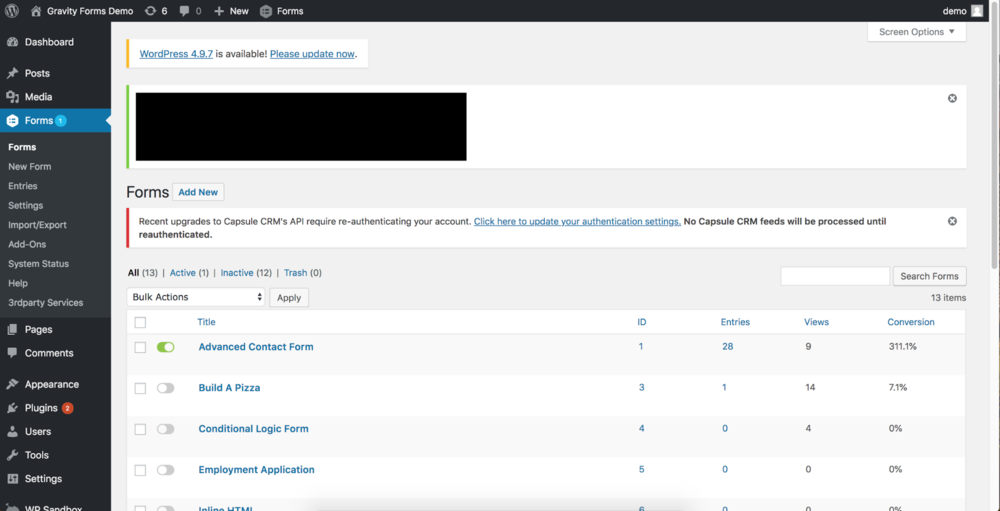
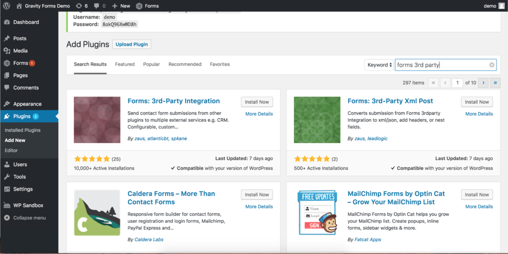
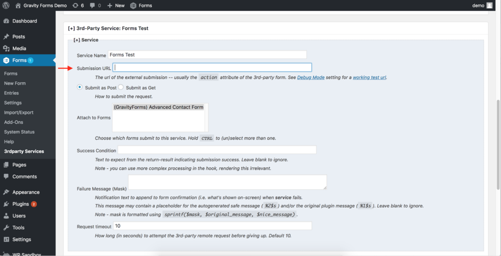

[_Scott McKee_](https://community.activeprospect.com/memberships/7557680-scott-mckee)

Updated November 13, 2023. Published January 11, 2021.

Details

# Using Gravity Forms in WordPress to Submit to LeadConduit

Learn how to send leads to LeadConduit from Gravity Forms on your Wordpress site.

### 1\. Install Gravity Forms on WordPress and create your form

After obtaining your Gravity Form license, install Gravity Forms on WordPress by following the [instructions](https://docs.gravityforms.com/getting-started/#installing-gravity-forms) on their website.

Create a form by first clicking on ""Forms"" on the left pane of your WordPress Dashboard's Home page and then click **Add New**.

### 2\. Configure Gravity Forms to send leads to LeadConduit

To send lead data into LeadConduit, you will need to use the “Forms” plugin. _This step will only set LeadConduit as the location to send data; we will map the actual data being sent in the next step._

To install Forms, mouse over the **Plugins** button on the left pane of your WordPress site and select **Add New**. Type in “forms 3rd Party” and you will find the “Forms: 3rd-Party Integration” in the list. Install and activate the plugin.

**3\. Set the location to which the Forms integration will send lead data.**

Mouse over **Forms** and click on **3rdparty Services** in the expanded menu. In the **3rd-Party Service: Forms Test** section, find the Submission URL box. This is where you will enter your LeadConduit posting URL, found in your [Submission Docs](https://community.activeprospect.com/posts/4109880-finding-and-using-submission-docs).

**4\. Map your Gravity Form fields to LeadConduit fields**

Gravity Forms now knows _where_ to send the lead data, but the form fields must still must be properly mapped, so you will need to map the Gravity Form fields to send data to LeadConduit fields.

Scroll down and find the **Mapping** subsection. Here you will map the form’s fields (the Form Submission Field) to LeadConduit flow field labels (3rd-Party Field). The LeadConduit flow field labels can be found in your [Submission Docs](https://community.activeprospect.com/posts/4109880-finding-and-using-submission-docs).

Keep in mind that the third-party plug-in is only capable of sending data if the form element’s [input name](https://www.w3schools.com/tags/att_input_name.asp) has a single “\_” prefix. For example, where \`input\_18\` would be acceptable, \`input\_18.1\` would not be. For this reason, we suggest the use of form element types like “Single Line Entry” and “Radio Button,” as their input names follow the acceptable syntax.

**Your Gravity Form is now ready to send lead data to LeadConduit.** If you’d like to configure more than one form for lead submission to LeadConduit, click the “Add Another Service” button at the bottom of the mapping menu and repeat this process.

Type something
