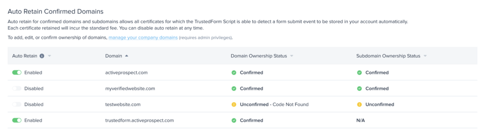
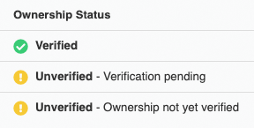

[_Caitie Clarke_](https://community.activeprospect.com/memberships/7557576-caitie-clarke)

Updated May 14, 2025. Published March 29, 2022.

Details

# Verify Domain Ownership

Verify your domains in your ActiveProspect Account to start gaining domain specific insights.

### Why Verify?

As a site-owner generating TrustedForm certificates, we want to provide you insights into domain specific certificate volume and give you credit for TrustedForm certificates claimed from your domains. To do that, all you have to do is verify you are the domain owner.

Verifying ownership of domains and sub-domains where you have implemented the TrustedForm Script, lets us positively verify that you created a lead associated with the TrustedForm Certificate.

Once your domain is added, no other account can claim ownership of that domain.

### Verification Process

The process of verifying your domains is simple; we generate a unique code per domain that you add to your domain's dns record and we check for a match in the background.

### 1\. Add your domains to ActiveProspect Account

1. Navigate to the Domain section in [My Account](https://account.activeprospect.com/domains) (if you do not see a Domains, please talk to your admin, this is a permission setting)
2. Select Add Domains
3. List all domains you want to verify
1. If you are verifying subdomains, you can individually add and verify subdomains. Or you can just add the root domain and you'll have an option in step 2 to verify all subdomains.

### 2\. Get your verification code from ActiveProspect Account

1. Under Actions, select the Verify Ownership link for the domain you are ready to verify
2. Copy the unique code

### 3\. Add a TXT record in your domain's DNS registrar

1. In a second browser window or tab, sign in to your domain's DNS registrar/host
2. Go to your domain’s DNS records. The page might be called something like DNS Management, Name Server Management, Control Panel, or Advanced Settings.
3. Select the option to add a new TXT record
1. If you're verifying an individual subdomain, you'll want to add the TXT record to the root domain in your DNS. If you're verifying multiple subdomains for one root domain, your root domain should have multiple TXT records.
4. In the TXT record, set the unique code as the value/answer/destination (the field names vary based on your registrar).

### 4\. (Optional) Verify all subdomains - NEW

If you're verifying a root domain, you'll see an option to also verify all subdomains (STEP 3). If this is selected and auto-retain is enabled for the root domain, auto-retain will also be enabled for **all** subdomains.

_**This will also be reflected under the 'Auto Retain Confirmed Domains' section in [TrustedForm Certify tab](https://app.trustedform.com/certificates/issue?__hstc=41051389.ae54412870ba112d988a98919d458305.1734639748363.1745983592484.1745987807012.301&__hssc=41051389.5.1745987807012&__hsfp=4052119064), as follows:**_

**_Subdomain Ownership Statuses Explained:_**

- **Confirmed:** This status appears when the option to also verify all subdomains is checked for the given domain. Ownership of subdomains is confirmed.
- **Unconfirmed:** This status appears when ownership of subdomains has not been confirmed (the option to also verify all subdomains is not checked).
- **N/A:** This status appears when the domain itself is a subdomain. Subdomain ownership confirmation is not applicable here because the option to verify subdomains only applies to root domains.

### 5\. Tell ActiveProspect Account to check your verification code

1\. Navigate back to your ActiveProspect Account tab, and select Begin Verification. Once selected, we will star the process of verifying your domain.

2\. Refresh the page to check for updated ownership status

### Do you have a CNAME record on the domain you want to verify?

CNAME records are common for subdomains and TXT records can't be added to domains with CNAME records. If you're verifying a subdomain, add the TXT record to the root domain. If you're verifying multiple subdomains, your root domain can have multiple TXT records (one for each subdomain).

### Domain Statuses

Once you have initiated the verification process, we will continuously check and update the domain status until you remove the domain.

Ownership Status:  represents the current status of the domain. Refresh the page to see the most up-to-date ownership statuses.

Last Checked: timestamp of the last time we checked the verification status of the domain (every time we attempt a verification)

Last Verified:  timestamp of the last successful verification of the domain

### Ownership Status Reasons Explained

- **Verified**: You have proved ownership of the domain! We successfully matched the unique code with your domain's dns record
- **Unverified**: We have not proved ownership of the domain.
  - Ownership not yet verified: you have not started the verification process for this domain
  - Verification pending: you have initiated the verification process but we have not yet verified ownership
  - Code Not Found: you have begun the verification process but no code is found on the dns record.
  - Connection error: there has been a timeout. If an already verified domain receives a connection error, then we will retry verification 10 times using exponential backoff. After 10 connection errors, the domain will be marked as unverified.
  - Domain not found: Domain doesn't exist
  - Code not found: We successfully checked the domain, but there was not a TXT record with the correct code

### Troubleshooting Tips:

- We run a domain verification check in the background at different cadences once you have started the verification process for a specific domain
  - We check **unverified** domains every 5 minutes.
  - We check **verified** domains once a day at midnight (Central Standard Time)
- If the ""Last Checked"" and ""Last Verified"" timestamps are different, the verification has failed.  Meaning, we did not receive a successful verification when last checked.
- A domain is marked unverified if it hasn't been verified in three days.
  - The ownership status will stay verified for a 3 day grace period, if after 3 days of attempts to reverify the ownership status successfully, the verified status will change to unverified with a reason. This grace period is to provide time for you to make planned updates to your domain records and not have your ownership status impacted.
- The Ownership Status - \[reason\] will provide information for you to investigate possible causes of the change in verification status.
- Domains rarely become unverified, common reasons that ownership status changes from verified to unverified;
  - the code is deleted from the TXT record answer
  - loss of ownership of the domain
- If you delete the code in the TXT record answer, all you need to do is re-add the same code back in. No need to generate a new domain code in your ActiveProspect Account.
- Make sure to verify your sub-domains if you wish to auto claim from those domains.
- Only users with the permission, ""Manage user and domains for this account"" will be able to see and manage domains. If you need permissions, please contact your account admin or [support@activeprospect.com](mailto:support@activeprospect.com)

**FAQ**
1. **Can I use the \`verify all subdomains\` checkbox if I’ve already verified some subdomains individually?**
     - Yes. If you have already verified subdomains and then use the \`verify all subdomains\` checkbox on your root domain, it will be duplicative, but that's alright. You can choose to delete the individual subdomains and the related TXT records from your DNS, but it’s not required.
2. **Does the TXT record now only need to exist on the root domain?**
     - The TXT record used to confirm ownership, whether for the root domain or a subdomain, should be placed on the root domain in your DNS. But now, with the \`verify all subdomains\` checkbox, you only need to add your root domain, grab the single TXT record, and add it to the root domain’s DNS entry. This avoids having multiple TXT records on the root domain for different subdomains.
3. **Will the \`verify all subdomains\` checkbox include verification of sub-domains of a sub-domain?**
     - Yes, it should confirm ownership of all subdomains under the root domain. For example, if the root domain is example.com, then both blog.example.com and shop.blog.example.com would be covered.
4. If I’ve already verified my root domain, do I just need to check the box to \`verify all subdomains\`, or is there more to it?
     - That’s correct, you just need to enable the \`verify all subdomains\` checkbox and save. No additional steps are required.

Type something
