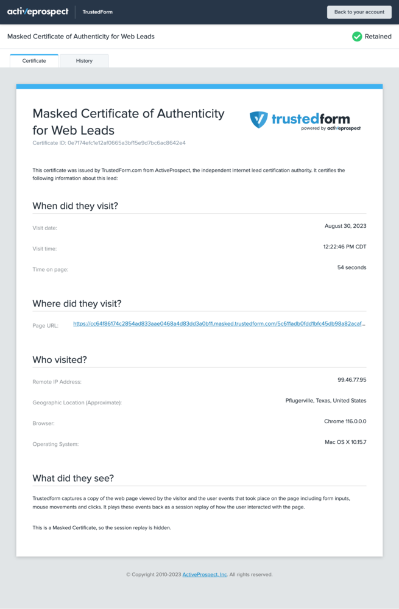

[_Ashley Thomas_](https://community.activeprospect.com/memberships/7557566-ashley-thomas)

Updated February 28, 2025. Published December 14, 2022.

Details

# What is a masked TrustedForm certificate?

Creating and using masked TrustedForm certificates

The TrustedForm retaining process creates a certificate that can be used with the lead data to document the consumer session without exposing the web site where the consumer filled in a form. This documents the lead for the lead buyer.

A masked certificate:

- is a copy of a normal TrustedForm certificate that conceals a lead's originating web site
- is created during the retain process by default, **EXCEPT** **for TrustedForm certificates generated by Facebook Lead Ads**
- is a valid TrustedForm certificate with its own 69-character certificate URL, like the originally retained certificate.
- does not display the page URL of the web site on which the lead was created
- does not show the Session Replay or Event Log
- can be retained as normal, and will be retained in your account. See [more information about retaining a masked certificate](https://community.activeprospect.com/posts/4887952-why-can-t-i-retain-a-masked-certificate) for more discussion.
- can be used with the Insights product to request the same properties available to an unmasked certificate. However, the domain property will report as masked version of the domain that correlates to actual domain so that it suitable to use for lead filtering without exposing the source.

#### How lead vendors use the masked certificate

Resellers of leads sometimes use masked certificates with the lead data to document the consumer session without exposing the web site where the consumer filled in a form.

#### Cautions for lead buyers

The masked certificate provides much consumer information to describe the consumer session, such as IP address, location, etc., and ensures the buyer that there is a documented lead being presented by the seller. However, in case of a consumer complaint, the Lead Buyer may need to have access to the full certificate, which includes the page location of the form and the consumer session playback. For this reason, the use of a masked certificate requires a level of relationship with the lead vendor from which it is received. The lead vendor providing masked certificates must retain the certificates and maintain their TrustedForm account for several years in order to service requests for the full certificate. Please [see our community page](https://community.activeprospect.com/) for more information.

#### How to generate a masked certificate using the certificate API

To generate a masked certificate from a full TrustedForm Certificate, follow these steps:

1. Retain the TrustedForm certificate for the lead using the [instructions on our developer site](https://developers.activeprospect.com/docs/trustedform/api/v4.0/tag/Retain/) or in [this community article](https://community.activeprospect.com/posts/4885100-how-to-claim-an-individual-trustedform-certificate).
2. Capture the response from the retain process, which will include the masked\_cert\_url. Here is an example.     ""masked\_cert\_url"": "" [https://cert.trustedform.com/1145b610ac97aa9f92d7cd2195446eac5e67ce53](https://example.com/1145b610ac97aa9f92d7cd2195446eac5e67ce53)""
3.  Once you have the masked certificate that corresponds to your lead, you can pass this value to your customer as the lead's TrustedForm certificate.

#### More Information

See our community pages for [more information about retaining a masked certificate](https://community.activeprospect.com/posts/4887952-why-can-t-i-retain-a-masked-certificate).

See our series on the community pages for [more information about masked certificates](https://community.activeprospect.com/series/4882045-troubleshooting-trustedform-masked-certificate).

Masked Certificate

Unmasked Certificate

**The following data points are available with masked certificates:**

- Share URL (only in v2.0)
- Masked
- Outcome
- Reason
- Page Scan
- Fingerprint (Match Lead)
- Lead Age
- Browser Type
- Operating System
- IP Address
- **Domain -  you get a masked version of domain**
- Geo Location
- Time on page
- Form Input Method

Type something
