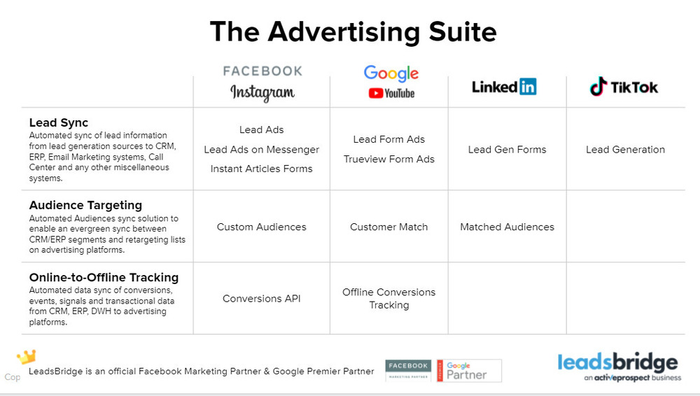

[_Claudia Melis_](https://community.activeprospect.com/memberships/8017840-claudia-melis)

Updated May 29, 2023. Published May 24, 2023.

Details

# What is LeadsBridge?

LeadsBridge is an advertising automation platform for Lead Generation, Audience Sync, and Offline Conversions Sync. Our suite includes three main products to sync leads, contacts, and conversions data between **Facebook**, **Google**, **LinkedIn**, **TikTok**, and your business assets such as **CRM**, **Email Marketing software**, call center, database, and other various platforms.

In 2021, LeadsBridge was officially acquired by ActiveProspect – the industry leader in consent-based marketing. Today, LeadsBridge and ActiveProspect are joining forces to propel their businesseseven further into the advertising world.

## **Who's using LeadsBridge?**

Companies that want to streamline their advertising activities by integrating their marketing tech stack with Facebook, Google, Linkedin, TikTok, and more.

Type something
