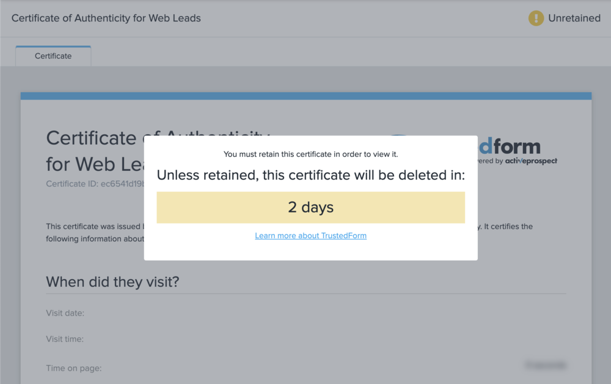

[_Ashley Thomas_](https://community.activeprospect.com/memberships/7557566-ashley-thomas)

Updated August 30, 2023. Published December 12, 2022.

Details

# Why can't I retain a Masked Certificate?

A masked certificate is just like any other TrustedForm certificate in many ways. The format of the Certificate URL is the same and the certificate is proof of a session giving the location and much other information about the consumer who filled out the web form. A masked certificate is like any certificate, except: the masked certificate doesn't list the Page URL for the form and excludes the session replay showing the consumer session.

If you can't retain a masked certificate, it's likely to be because of these two factors:

#### A. Short Retain Window

Masked TrustedForm Certificates have a 72 hour retain window. They cannot be extended. This means that they must be retained within 72 hours of their creation.

B. Your retain always has outcome ""failure"" with the reason ""None of the provided fingerprints match""

This message is a cautionary message because the web session html is missing in a masked certificate, and it is impossible to check that the email and phone  in a masked certificate matches the lead information.

#### Check whether you should be able to retain the Masked certificate:

1\. Bring up the full Certificate URL, beginning with [https://cert.trustedform.com](https://cert.trustedform.com/), in your browser.

2\. If the certificate can be retain, the page will show a banner giving the retain window, as in the below example.

For more information about masked certificates, [check out our Community pages](https://community.activeprospect.com/series/4882045-troubleshooting-trustedform-masked-certificate).

Consult our Community pages for [information about retaining a certificate](https://developers.activeprospect.com/docs/trustedform/getting-started-with-claiming/).

Type something
