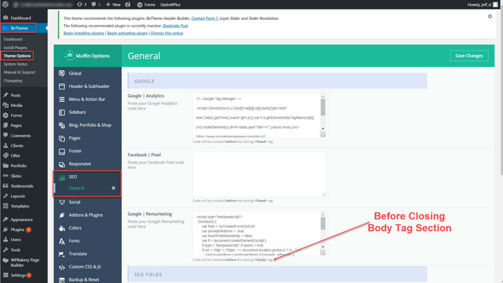
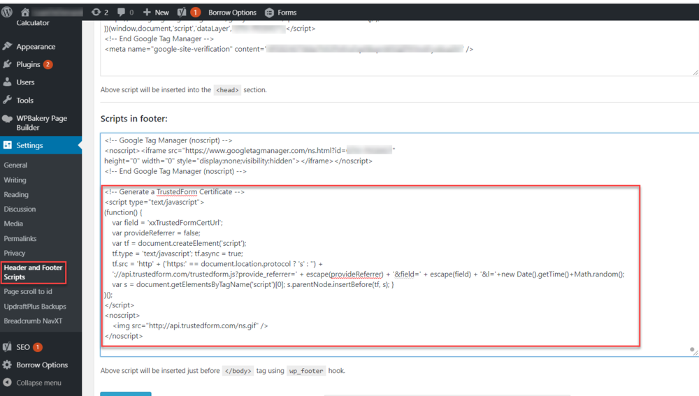

[_Christopher Williams_](https://community.activeprospect.com/memberships/7846678-christopher-williams)

Updated November 30, 2020. Published November 2, 2020.

Details

# WordPress Form Generators and TrustedForm

There are probably a thousand WordPress form generators out there, with old ones disappearing and new ones appearing faster than anyone can keep track. Some of them deal with script-inserted fields gracefully, and some do not.

# Adding the TrustedForm Script to Your Form Page

Our customers have some success by placing the TrustedForm script either in the same place allotted in WordPress for Google's SEO tool, and also some success placing it using the WordPress Headers and Footers Scripts tool.

These screen shots illustrate where to find those options in your WordPress dashboard.

WordPress for Google's SEO tool:

WordPress Headers and Footers Scripts tool:

# Don't Include a TrustedForm Field in Your Form

You should not, in general, create a TrustedForm hidden field in your form using your form generator. The TrustedForm script will add the necessary hidden field to the form in the user's browser memory at run time. Any same-named field already in place could interfere with that process.

# Checking Whether the Script Is Working

You can check a loaded form page for the presence of a populated hidden field named ""xxTrustedFormCertUrl\_0"" in the browser's page DOM by using the browser's ""inspect"" feature. (It will not be visible in the ""view page source"" feature because it exists only in memory, not in the source code.)

# Capturing and Submitting the TrustedForm Certificate URL field

There's still no guarantee that the field added by the TrustedForm script will be processed and submitted. That depends on how any scripts that are products of the form generator interact with the form.

Type something
