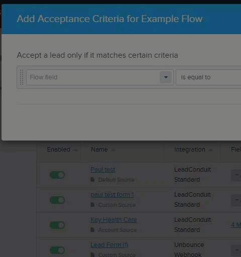
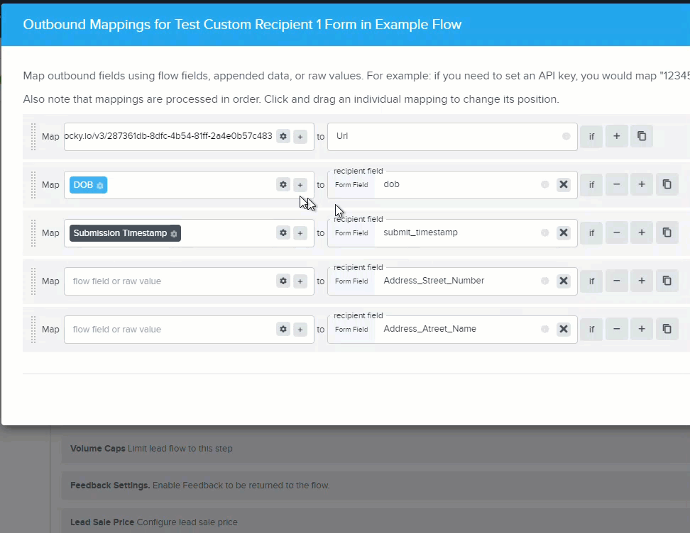

---
tags:
  - buyer-focused
  - intermediate
  - how-to
  - data-management
  - fields-focused
  - technical
  - operation
---

# Field Configuration Guide

Master field configuration to ensure clean, consistent data throughout your flows. Learn how field classes automatically parse and validate data, giving you powerful components to work with.

## 📍 You Are Here

You're learning how fields work in your flows - from automatic parsing and validation to accessing components and formatting output. Understanding fields is key to building reliable data pipelines.

## 🎯 What You'll Master

- Field classes and their capabilities
- Automatic parsing and standardization
- Accessing field components
- Custom formatting for delivery
- Creating and managing custom fields

## 🔑 Understanding Field Classes

Field classes define how data is parsed, validated, and made available throughout your flow. Each class provides:

- **Automatic parsing** of various input formats
- **Standardization** to consistent internal format
- **Validation** with valid/invalid flags
- **Components** for granular access
- **Formatting options** for output

### Core Field Classes

| Field Class | Purpose | Example Input | Standardized Format |
|------------|---------|---------------|-------------------|
| **String** | Plain text | "John Smith" | As submitted |
| **Email** | Email addresses | "John@EXAMPLE.com" | "john@example.com" |
| **Phone** | Phone numbers | "(555) 123-4567" | "5551234567" |
| **Date** | Date values | "12/25/2023" | "2023-12-25" |
| **Number** | Numeric values | "$1,234.56" | 1234.56 |
| **Boolean** | True/False | "Yes", "1", "T" | true/false |
| **State** | US States/Canadian Provinces | "California", "CA" | "CA" |
| **URL** | Web addresses | Various formats | As submitted |

## 🔧 Working with Field Components

### Accessing Components

Click the ellipsis (...) next to any field to see available components:



### Email Field Components

For email "john.doe@company.example.com":
- **email** → "john.doe@company.example.com" (full, lowercased)
- **email.user** → "john.doe"
- **email.domain** → "company.example.com"
- **email.host** → "company"
- **email.tld** → "com"
- **email.raw** → Original submission (preserves case)

### Phone Field Components

For phone "(555) 123-4567 ext 890":
- **phone** → "5551234567" (standardized)
- **phone.area** → "555"
- **phone.exchange** → "123"
- **phone.line** → "4567"
- **phone.extension** → "890"
- **phone.number** → "5551234567"
- **phone.is_tollfree** → false
- **phone.raw** → "(555) 123-4567 ext 890"

### Using Components in Rules

Create precise rules using components:

```
Rule: email.domain is equal to "gmail.com"
Purpose: Filter consumer email addresses

Rule: phone.area is one of ["212", "646", "917"]
Purpose: New York City area codes only

Rule: email.tld is not equal to "com"
Purpose: International domains
```

## 📝 Field Formatting Options

### Configuring Output Format

Click the gear icon next to fields to access formatting options:



### Date Formatting Examples

Internal format: "2023-12-25"

Available output formats:
- **MM/DD/YYYY** → "12/25/2023"
- **DD/MM/YYYY** → "25/12/2023"
- **Month DD, YYYY** → "December 25, 2023"
- **YYYY-MM-DD** → "2023-12-25"
- **Unix Timestamp** → 1703462400

### Phone Formatting Examples

Internal format: "5551234567"

Available output formats:
- **(555) 123-4567** (US Standard)
- **555-123-4567** (Dashed)
- **555.123.4567** (Dotted)
- **+1 555 123 4567** (International)
- **5551234567** (Raw digits)

## 🎨 Special Field Classes

### Range Fields

Accept single values or ranges:
- Input: "25" → Components: min=25, max=25, avg=25
- Input: "18-65" → Components: min=18, max=65, avg=41.5, middle=41

Perfect for age ranges, income brackets, or score ranges.

### Postal Code Fields

**US Format**:
- Input: "90210-1234"
- Components:
  - postal_code → "90210"
  - postal_code.zip → "90210"
  - postal_code.plus4 → "1234"
  - postal_code.country_code → "US"

**Canadian Format**:
- Input: "K1A 0B1"
- Components:
  - postal_code → "K1A 0B1"
  - postal_code.fsa → "K1A" (Forward Sort Area)
  - postal_code.ldu → "0B1" (Local Delivery Unit)
  - postal_code.country_code → "CA"

### TrustedForm URL Fields

Special handling for consent certificates:
- **trustedform_url** → Full URL
- **trustedform_url.age** → Age in seconds
- **trustedform_url.is_expired** → true/false
- **trustedform_url.type** → web/mobile/facebook/masked

## 🛠️ Custom Field Configuration

### Creating Custom Fields

1. **Navigate to Fields**
   - Flow Editor → Fields tab
   - Or Account → Custom Fields

2. **Add New Field**
   - Click "Add Field"
   - Choose field name (lowercase, underscores)
   - Select field class
   - Add description

3. **Best Practices**
   - Use descriptive names: `loan_amount` not `field1`
   - Choose appropriate class for validation
   - Document purpose in description
   - Consider reusability across flows

### Custom Field Examples

**Financial Fields**:
```
Field: annual_income
Class: Number
Description: Applicant's stated annual income

Field: income_range  
Class: Range
Description: Income bracket (e.g., "50000-75000")
```

**Industry-Specific**:
```
Field: insurance_type
Class: String
Description: Type of insurance (auto, home, life)

Field: coverage_amount
Class: Number
Description: Requested coverage in dollars
```

## 💡 Field Validation Behavior

### Valid vs Invalid

Fields set a `.valid` property during parsing:
- ✅ **Valid**: Data parsed successfully
- ❌ **Invalid**: Parsing failed, original value preserved

### Important: Validation Doesn't Block

Type validation NEVER rejects leads. To reject invalid data:

```
Acceptance Criteria:
Rule: email.valid is true
Reason: Invalid email format

Rule: phone.valid is true
Reason: Invalid phone number
```

### Validation Examples

**Email Validation**:
- "john@example.com" → valid: true
- "not-an-email" → valid: false
- "john@.com" → valid: false

**Phone Validation**:
- "555-123-4567" → valid: true
- "123" → valid: false
- "555-CALL-NOW" → valid: false (letters)

## 🚀 Advanced Field Techniques

### Composite Fields

Create fields that combine others:

```
Field: full_address
Template: {{street}} {{city}}, {{state}} {{postal_code}}
Class: String
```

### Conditional Formatting

Use templates for dynamic formatting:

```
{{#if phone.is_tollfree}}
  1-800-CALL-NOW
{{else}}
  {{phone.area}}-{{phone.exchange}}-{{phone.line}}
{{/if}}
```

### Field Aliases

Map multiple input names to one field:

Source mappings:
- "telephone" → phone
- "phone_number" → phone
- "contact_phone" → phone

All map to your standard `phone` field.

## 📊 Field Best Practices

### Naming Conventions

**DO**:
- `first_name` (lowercase, underscores)
- `email_address`
- `loan_amount`

**DON'T**:
- `FirstName` (avoid capitals)
- `email-address` (no dashes)
- `field1` (not descriptive)

### Standard vs Custom

**Use Standard Fields When Possible**:
- Automatic type validation
- Consistent components
- Better reporting
- Easier integration

**Create Custom Fields For**:
- Business-specific data
- Industry requirements
- Calculated values
- Special validation needs

### Documentation

Always document:
- Field purpose
- Expected values
- Validation rules
- Business logic

## 🔍 Troubleshooting Fields

### "Field Not Found"

**Check**:
- Spelling matches exactly
- Using correct namespace (lead., appended.)
- Field exists in flow
- Source mapping configured

### "Invalid Format"

**Verify**:
- Input matches expected format
- Using correct field class
- Not sending arrays to single-value fields

### "Missing Components"

**Remember**:
- Not all fields have components
- String fields are as-submitted only
- Check field class documentation

## 📚 Field Class Reference

Quick reference for all field classes:

| Class | Accepts | Standardizes To | Key Components |
|-------|---------|----------------|----------------|
| String | Any text | As submitted | None |
| Email | Valid emails | Lowercase | user, domain, host, tld |
| Phone | US/Canada phones | Digits only | area, exchange, line |
| Number | Integers, decimals | Float | None |
| Boolean | T/F, Yes/No, 1/0 | true/false | None |
| Date | Various formats | YYYY-MM-DD | Formatting options |
| State | Names or codes | 2-letter code | name |
| URL | Valid URLs | As submitted | protocol, host, path |

## 📚 Related Documentation

- [Types Reference](../../reference/types.md) - Complete type system
- [Field Mappings](./field-mapping.md) - Transformation strategies
- [Templates](./working-with-templates.md) - Dynamic field access

---

🎯 **Data Excellence**: Understanding field classes transforms messy input into clean, structured data. Master fields to build flows that handle any data format with confidence!