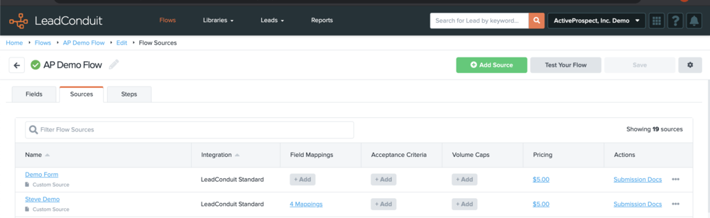
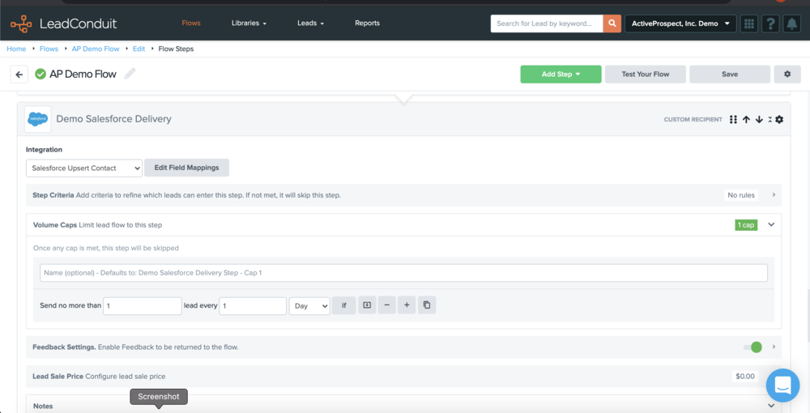
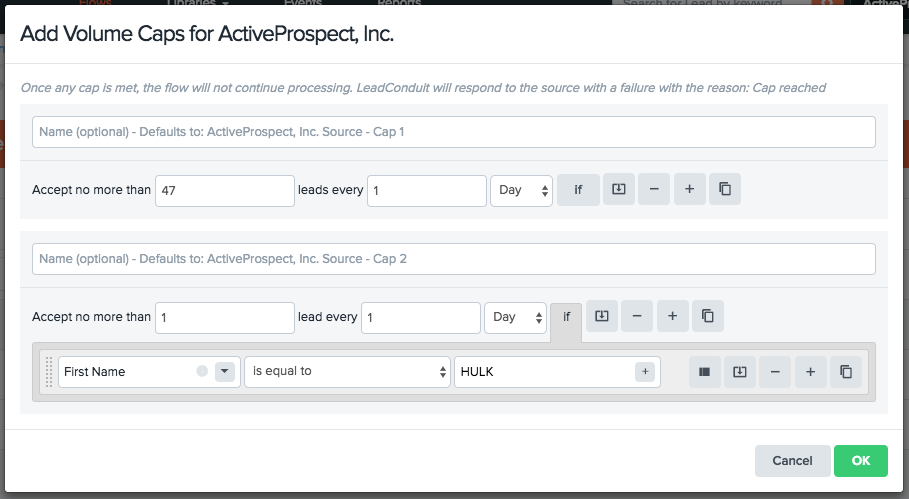

---
tags:
  - buyer-focused
  - intermediate
  - how-to
  - flows
  - integrations
  - operation
  - technical
---

# Managing Flow Steps

Master the art of configuring, organizing, and optimizing steps within your LeadConduit flows. Learn how each step type works and how to build efficient lead processing pipelines.

## 📍 You Are Here

You're learning to manage the building blocks of your flows - steps. Each step performs a specific function, from validating data to delivering leads, and understanding how to configure them is key to successful lead management.

## 🎯 What You'll Master

- Understanding step types and their roles
- Configuring step components
- Managing step order and dependencies
- Enabling/disabling steps
- Troubleshooting step issues

## 🧩 Step Types Overview

### Enhancement Steps

Add or modify data:
- **Data Append**: Add demographic info
- **Validation**: Verify email/phone
- **Scoring**: Calculate lead quality
- **Geocoding**: Add location data

### Filter Steps

Control lead flow:
- **Business Rules**: Stop low-quality leads
- **Compliance**: Block non-compliant data
- **Routing Logic**: Direct to specific paths
- **Volume Control**: Enforce caps

### Delivery Steps

Send leads to destinations:
- **Recipients**: CRM systems, dialers
- **Webhooks**: Custom endpoints
- **Email**: Notifications
- **Storage**: Data warehouses

## 🔧 Step Components

### Step Criteria

Control when a step executes:

```
Execute When:
- Previous step succeeded
- State equals "CA" or "TX"
- Lead score > 70
- Time is between 9 AM - 5 PM
```

**Configuration Example**:


### Field Mappings

Connect LeadConduit fields to destination fields:

**Source Fields** → **Destination Fields**
```
email         → contact_email
phone_1       → primary_phone
first_name    → fname
last_name     → lname
```

**Best Practices**:
- Map all required fields
- Use consistent naming
- Apply transformations as needed
- Test with sample data

### Rules (Filters Only)

Define conditions to stop lead processing:

**Common Filter Rules**:
- Stop if email invalid
- Stop if phone disconnected
- Stop if duplicate detected
- Stop if outside business hours

### Feedback Configuration

Enable two-way communication:
- Receive delivery status
- Update lead outcomes
- Track conversions
- Handle rejections

## 📋 Configuring Steps

### Step 1: Add a Step

1. Click **Add Step** in your flow
2. Choose step type:
   - Enhancement
   - Filter
   - Delivery
3. Select specific integration

### Step 2: Basic Configuration

**Name Your Step**:
```
Bad:  "Step 1"
Good: "Validate Email - BriteVerify"
Best: "Email Validation - Stop Invalid"
```

**Add Description**:
- Purpose of the step
- Special configuration notes
- Business rules applied

### Step 3: Configure Components

**For Enhancements**:
1. Select data provider
2. Map input fields
3. Configure output fields
4. Set error handling

**For Filters**:
1. Define filter rules
2. Set stop conditions
3. Configure rejection reasons
4. Enable logging

**For Deliveries**:
1. Enter endpoint details
2. Map all fields
3. Set authentication
4. Configure retries

### Step 4: Set Step Criteria

When should this step run?

```javascript
// Always run
criteria: "none"

// Conditional execution
criteria: {
  "previous_step.outcome": "success",
  "lead.state": ["CA", "TX", "FL"],
  "lead.score": { "greater_than": 50 }
}
```

## 🔄 Step Order and Dependencies

### Understanding Flow

Steps execute sequentially:
1. Source receives lead
2. Each step processes in order
3. Filters can stop processing
4. Deliveries send to recipients

### Managing Dependencies

**Before Moving Steps, Consider**:
- Data dependencies
- Filter logic
- Enhancement requirements
- Delivery prerequisites

**Example Flow Order**:
```
1. ✓ Standardize Phone Format
2. ✓ Validate Phone Number
3. ✓ Check Phone Against DNC
4. ✓ Filter: Stop if DNC Hit
5. ✓ Deliver to Call Center
```

❌ **Wrong Order**:
```
1. Check Phone Against DNC (fails - not formatted)
2. Standardize Phone Format
3. Validate Phone Number
```

## 🚫 Enabling and Disabling Steps

### When to Disable vs Delete

**Disable When**:
- Temporarily stopping functionality
- Testing flow changes
- Seasonal adjustments
- Troubleshooting issues

**Delete When**:
- Permanently removing functionality
- Cleaning up old configurations
- Simplifying flows

### How to Disable

1. Click the **gear icon** on the step
2. Select **Disable Step**
3. Acknowledge warnings about dependencies



### Understanding the Impact

When you disable a step:
- ⚠️ Lead data doesn't get processed by that step
- ⚠️ Downstream steps may fail if they depend on it
- ⚠️ Field mappings may break
- ⚠️ Filters may not work correctly

**Visual Indicators**:
- Disabled steps show with strikethrough
- Affected downstream steps are highlighted
- Warnings appear on dependent steps



### Re-enabling Steps

1. Click gear icon on disabled step
2. Select **Enable Step**
3. Verify all configurations still valid
4. Test with sample lead

## 💡 Step Best Practices

### Naming Conventions

Create clear, descriptive names:
```
✅ "Email Validation - Stop Invalid"
✅ "Phone DNC Check - Compliance Filter"
✅ "Salesforce Delivery - New Leads"

❌ "Step 1"
❌ "Filter"
❌ "Delivery"
```

### Organization Strategies

**Group Related Steps**:
1. All phone validations together
2. All compliance checks together
3. All deliveries at the end

**Use Notes**:
```
Note: This step requires phone to be formatted as 10 digits.
Business rule: Stop all leads outside CA during pilot phase.
```

### Performance Optimization

**Minimize API Calls**:
- Batch when possible
- Cache results
- Use conditional execution

**Order Efficiently**:
1. Cheap/fast filters first
2. Expensive enhancements later
3. Only enhance leads that will convert

## 🚧 Common Issues and Solutions

### "Step Configuration Incomplete"

**Check**:
- All required fields mapped
- Authentication configured
- Endpoint URL valid
- Required criteria set

### "Downstream Steps Affected"

**When disabling causes issues**:
1. Review dependent steps
2. Update field mappings
3. Adjust filter criteria
4. Test thoroughly

### "Step Timing Out"

**Solutions**:
- Increase timeout settings
- Check endpoint health
- Reduce batch size
- Add retry logic

### "Mappings Not Working"

**Verify**:
- Field names match exactly
- Data types compatible
- Required fields present
- Transformations applied correctly

## 📊 Monitoring Step Performance

### Key Metrics

Track for each step:
- Success rate
- Average processing time
- Error frequency
- Data append rate

### Using Step Reports

Access from Reporting:
```
Report: Step Performance Analysis
Columns: Step Name, Success %, Avg Time, Error Count
Group By: Step Type
Filter: Last 7 Days
```

### Optimization Indicators

**Needs Attention When**:
- Success rate < 95%
- Processing time > 2 seconds
- High error rate
- Frequent timeouts

## 🎯 Step Management Checklist

Before going live:
- [ ] All steps named clearly
- [ ] Configurations complete
- [ ] Dependencies verified
- [ ] Step order optimized
- [ ] Error handling configured
- [ ] Notes added for complex logic
- [ ] Test data processed successfully
- [ ] Performance metrics acceptable

## 📚 Related Documentation

- [Building Your First Flow](../getting-started/building-your-first-flow.md) - Flow basics
- [Types Reference](../../reference/types.md) - Data validation
- [Rules Reference](../../reference/rules.md) - Business logic

---

🎯 **Step Mastery**: Well-configured steps are the foundation of reliable lead processing. Take time to understand each component, test thoroughly, and monitor performance for optimal results!