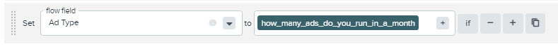

# Facebook Lead Ads Setup

Connect Facebook's native lead forms directly to your flows for real-time lead delivery. This guide walks you through setup, permissions, custom fields, and troubleshooting Facebook Lead Ads integration.

## 📍 You Are Here

You're setting up Facebook Lead Ads to automatically send leads from your Facebook and Instagram ads directly into your flow. No more manual exports or delayed lead delivery - get leads in real-time as soon as prospects submit your forms.

## 🎯 What You'll Achieve

- Real-time lead delivery from Facebook forms
- Automatic field mapping for standard fields
- Custom field configuration
- Multi-page management
- TrustedForm for Facebook integration

## 📋 Prerequisites

Before starting, ensure you have:

### Facebook Requirements
- **Admin access** to Facebook Business Manager
- **Full admin permissions** for the Facebook pages
- **Access to CRM settings** in Business Manager
- Your personal Facebook account to authorize the connection

### Required Permissions
Your Facebook account needs these permissions:
- ✅ Manage your ads
- ✅ Show a list of the Pages you manage
- ✅ Access Leads for your pages
- ✅ Manage accounts, settings, and webhooks for a Page
- ✅ Create and manage ads for your Page
- ✅ Read content posted on the Page

⚠️ **Important**: Missing any permission will cause connection failures or "Malformed Certificate" errors with TrustedForm.

## 🚀 Step 1: Connect Your First Facebook Page

### Access the Integration

1. **Open Your Flow**
   - Navigate to your flow in edit mode
   - Click the **Sources** tab
   - **Save your flow** if it's new (critical!)

2. **Add Facebook Source**
   - Click **Add Source**
   - Search for "Facebook"
   - Select **Facebook Lead Ads Inbound Routed**

### Authorize the Connection

3. **Facebook Authorization**
   - Click "Connect to Facebook"
   - Log in with your Facebook account
   - Grant all requested permissions
   - Don't skip any - all are required!

4. **Select Your Pages**
   - You'll see a list of available pages
   - Yellow dots indicate pages connected to other flows
   - Select the page(s) you want to connect
   - Click **Next**

5. **Confirm and Save**
   - Review your selections
   - Confirm the connection
   - **Save your flow** - don't forget this step!

💡 **Pro tip**: One Facebook page can only connect to ONE flow, but one flow can receive leads from MULTIPLE Facebook pages.

## 🔧 Step 2: Configure Field Mappings

### Standard Fields (Automatic)

Most Facebook fields map automatically to standard fields:

| Facebook Field | Maps To | Notes |
|---------------|---------|-------|
| full_name | first_name, last_name | Automatically split |
| email | email | Validated automatically |
| phone_number | phone | Normalized to standard format |
| city | city | |
| state | state | 2-letter abbreviation |
| zip_code | zip | |
| country | country | |
| company_name | company | |
| job_title | job_title | |

### Additional Standard Fields

These fields are supported but need to be added to your flow:
- **phone_2** → Work Phone
- **dob** → Date of Birth
- **gender** → Gender
- **marital_status** → Marital Status
- **military_status** → Military Status
- **platform** → Source Platform (Facebook, Instagram, etc.)

### Exceptions Requiring Custom Mapping
- `work_email` - Must be mapped as custom field
- `relationship_status` - Must be mapped as custom field

## 🎯 Step 3: Handle Custom Fields

Facebook custom questions need special configuration:

### Get the Field ID

1. **Submit a Test Lead**
   - Use [Facebook's Lead Ads Testing Tool](https://developers.facebook.com/tools/lead-ads-testing/)
   - Fill out your form with test data
   - Submit the test lead

2. **Find the Field Data**
   - Locate the test lead in Events
   - Open Technical Details
   - Search for `facebook_field_data_apros`
   - You'll see something like:
   ```json
   "facebook_field_data_apros": "[{\"name\":\"how_many_ads_do_you_run\",\"values\":[\"three\"]}]"
   ```

3. **Extract the Field ID**
   - In this example: `how_many_ads_do_you_run`
   - This is your custom field ID

### Map the Custom Field

4. **Configure Mapping**
   - Go to Sources → Facebook Lead Ads
   - Click **Field Mappings**
   - Add new mapping:
     - Left side: Your field name (e.g., "Ad Count")
     - Right side: The Facebook field ID
   - Click **Insert {Field ID}**



5. **Test the Mapping**
   - Resubmit your test lead
   - Verify the custom field appears correctly

## 🔄 Managing Multiple Pages

### Connecting Additional Pages

To add more Facebook pages to the same flow:
1. Follow the same connection process
2. Select additional pages
3. Each page becomes a separate source
4. All leads flow to the same destination

### Switching Page Connections

To move a page to a different flow:
1. Connect it to the new flow
2. The previous connection breaks automatically
3. Confirm the change when prompted

### Disconnecting Pages

To disconnect a page:
1. Go through the connection process
2. Unselect the connected page
3. Acknowledge the disconnection
4. The source remains but stops receiving leads

## 🎨 Advanced Configuration

### Form-Level Routing

Route leads based on which form they came from:

```
Filter: Facebook Form Routing
Rule: form_id is equal to "123456789"
Action: Route to specific destination
```

### Platform Detection

Handle leads differently by platform:

```
Filter: Instagram Only
Rule: platform is equal to "Instagram"
Action: Apply Instagram-specific logic
```

### Business Manager CRM Access

If using custom Leads Access configuration:

1. Go to [Business Manager Settings](https://business.facebook.com/settings)
2. Navigate to **Integrations** → **Lead Access**
3. Find your page
4. Click **CRMs**
5. Select "LeadConduit Lead Ads Integration"
6. Click **Assign Access**

## 🚫 Troubleshooting

### "Page Already Connected"

**Problem**: Yellow dot shows page connected elsewhere
**Solution**: 
- Identify the other flow
- Decide which flow should receive leads
- Connect to new flow (auto-disconnects from old)

### "Missing Permissions"

**Problem**: Can't see pages or connection fails
**Solution**:
1. Check Facebook Business Manager permissions
2. Verify personal Facebook settings
3. Re-authorize with all permissions
4. Check CRM access settings

### "Custom Fields Not Appearing"

**Problem**: Custom questions data missing
**Solution**:
1. Submit fresh test lead
2. Check exact field ID in facebook_field_data_apros
3. Verify mapping configuration
4. Ensure field exists in your flow

### "Disconnected Automatically"

**Common Causes**:
- Password changed on Facebook
- Page access revoked
- Business Manager changes

**Fix**: Disconnect and reconnect the affected pages

### "TrustedForm Malformed Certificate"

**Problem**: TrustedForm certificates show errors
**Solution**:
- Verify all Facebook permissions granted
- Re-authorize the connection
- Check page-level permissions

## 💡 Best Practices

**Test Before Launch**: Always submit test leads before running live campaigns.

**Document Custom Fields**: Keep a spreadsheet of custom field IDs for each form.

**Monitor Daily**: Check Events daily when first starting to catch issues early.

**Use Platform Field**: Track performance by platform (Facebook vs Instagram).

**Set Up Alerts**: Configure notifications for connection failures.

## 📊 Success Checklist

- [ ] Facebook Business Manager access verified
- [ ] All permissions granted
- [ ] Page(s) connected successfully
- [ ] Test lead submitted
- [ ] Standard fields mapping correctly
- [ ] Custom fields configured (if applicable)
- [ ] Flow saved after changes
- [ ] Live lead received successfully

## 📚 Related Documentation

- [Source Configuration](../getting-started/adding-sources.md) - General source setup
- [Field Mapping Guide](../data-management/field-mapping.md) - Advanced mapping
- [Facebook Troubleshooting](../troubleshooting/facebook-lead-ads-issues.md) - Common issues
- [TrustedForm for Facebook](../compliance/trustedform-facebook.md) - Consent tracking

---

📱 **Connected to Social**: Your Facebook Lead Ads are now flowing directly into your system. No more manual exports, no more delays - just real-time leads ready for immediate follow-up!